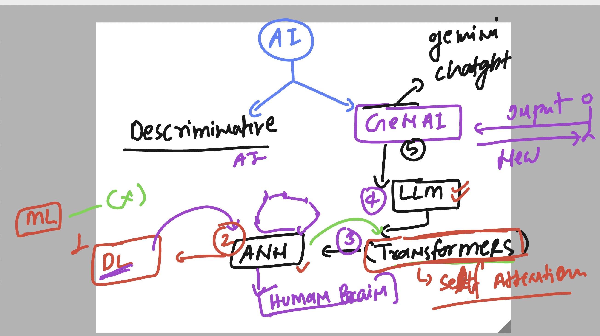

# walmart_LLM_Desing_Model_APIs_14thOct2025

### Basic intro to GenAI 



### any LLM is massively trained on public / private data as well


### LLM model understanding with data 


## any AI tools for Developer / tester ..etc 


### github copilot modes 


### creating directory and install flask in codespace 

```
@redashu ➜ /workspaces/walmart_LLM_Desing_Model_APIs_14thOct2025 (master) $ mkdir  webapp-python
@redashu ➜ /workspaces/walmart_LLM_Desing_Model_APIs_14thOct2025 (master) $ python -V
Python 3.12.1
@redashu ➜ /workspaces/walmart_LLM_Desing_Model_APIs_14thOct2025 (master) $ pip install flask 
Collecting flask
  Downloading flask-3.1.2-py3-none-any.whl.metadata (3.2 kB)
Collecting blinker>=1.9.0 (from flask)

```
### running python flask code 

```
@redashu ➜ /workspaces/walmart_LLM_Desing_Model_APIs_14thOct2025 (master) $ ls
README.md  day1  day2  day3  webapp-python
@redashu ➜ /workspaces/walmart_LLM_Desing_Model_APIs_14thOct2025 (master) $ cd webapp-python/
@redashu ➜ /workspaces/walmart_LLM_Desing_Model_APIs_14thOct2025/webapp-python (master) $ ls
ashu.py
@redashu ➜ /workspaces/walmart_LLM_Desing_Model_APIs_14thOct2025/webapp-python (master) $ python  ashu.py 
 * Serving Flask app 'ashu'
 * Debug mode: on
WARNING: This is a development server. Do not use it in a production deployment. Use a production WSGI server instead.
 * Running on all addresses (0.0.0.0)
 * Running on http://127.0.0.1:5000
 * Running on http://10.0.0.230:5000
Press CTRL+C to quit
 * Restarting with stat
 * Debugger is active!
 * Debugger PIN: 134-685-345
127.0.0.1 - - [14/Oct/2025 17:30:26] "GET / HTTP/1.1" 200 -
127.0.0.1 - - [14/Oct/2025 17:30:27] "GET /favicon.ico HTTP/1.1" 404 -
127.0.0.1 - - [14/Oct/2025 17:30:50] "GET /json HTTP/1.1" 200 -

```
