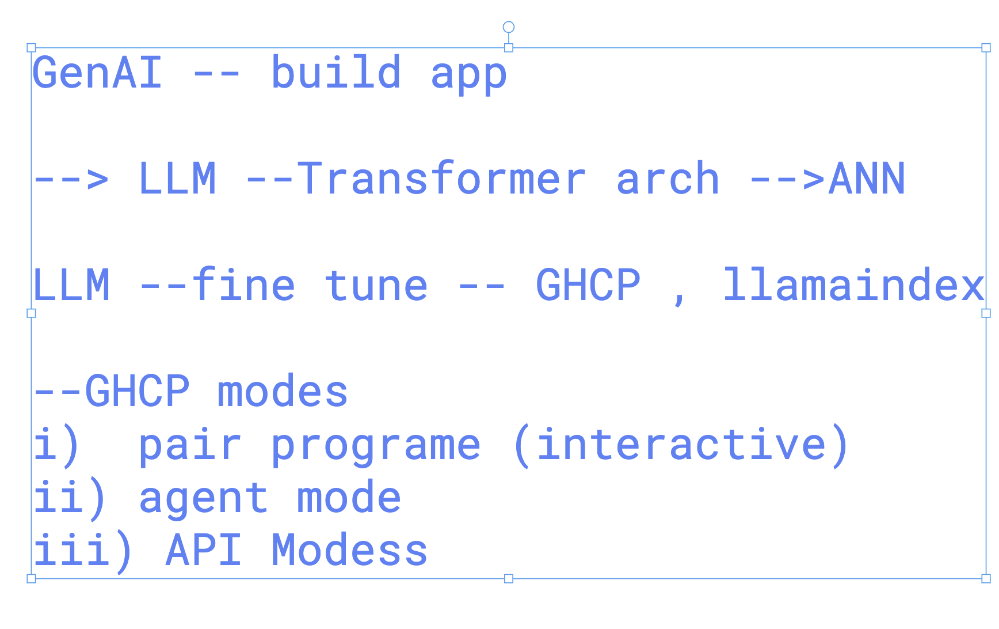

# walmart_LLM_Desing_Model_APIs_14thOct2025

### basic info 



## 

```
from openai import OpenAI
ashu_api_key = "" 
client = OpenAI(api_key=ashu_api_key)

response = client.chat.completions.create(
    model="gpt-5",
    messages=[
        {
            "role": "user",
            "content": "Write a short bedtime story about a unicorn."
        }
    ]
)

print(response.choices[0].message.content)

```